# Pokédex

A simple Pokédex application built using SvelteKit.

## Installation guide

1.  Clone the repo:

    `git clone https://github.com/TheInitZero/pokedex.git`

2.  Build the application:

    `npm run build`

3.  Preview the application:

    `npm run preview`

## Screenshots:

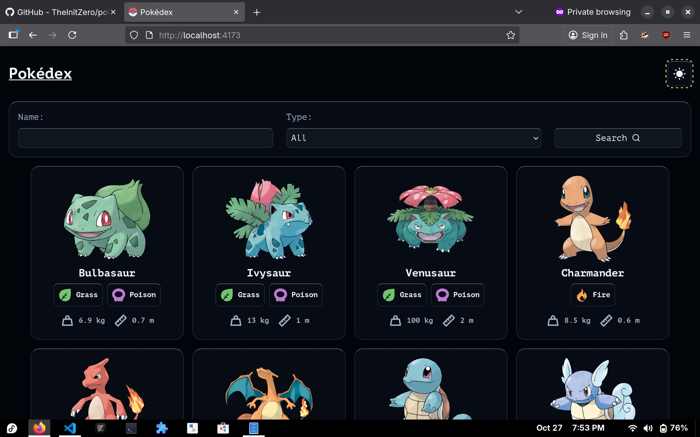
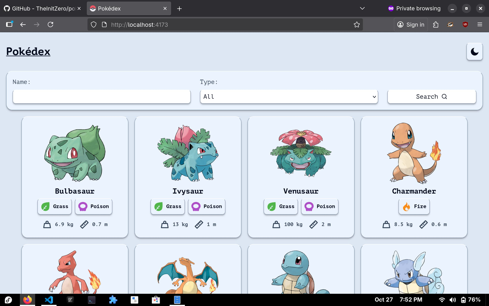

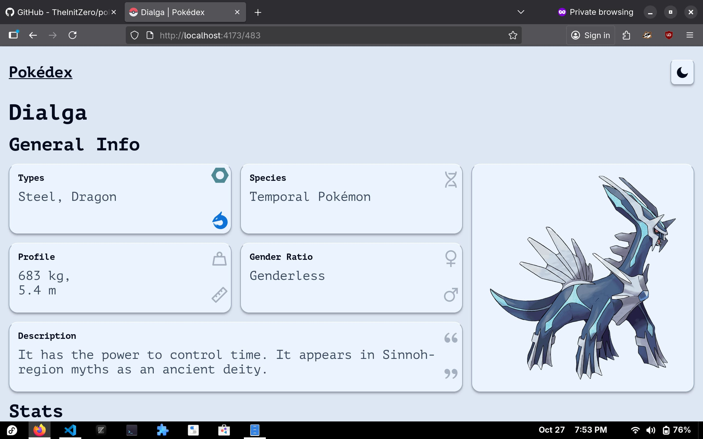
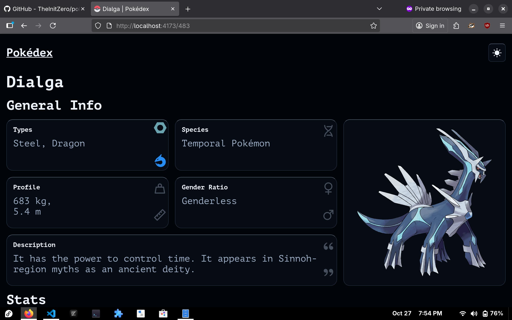

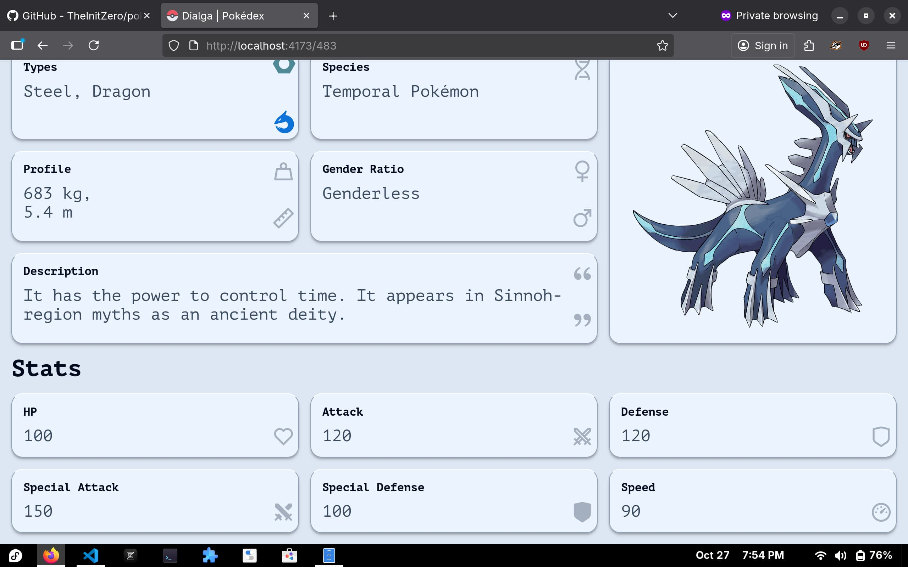
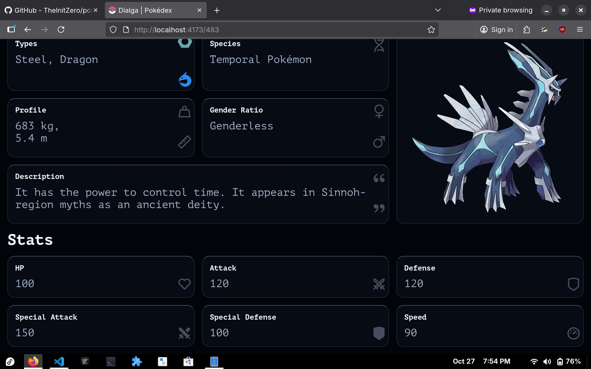

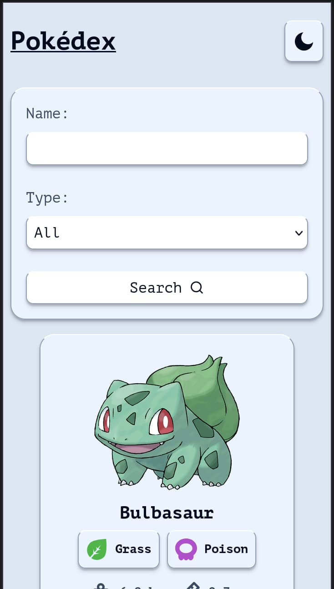
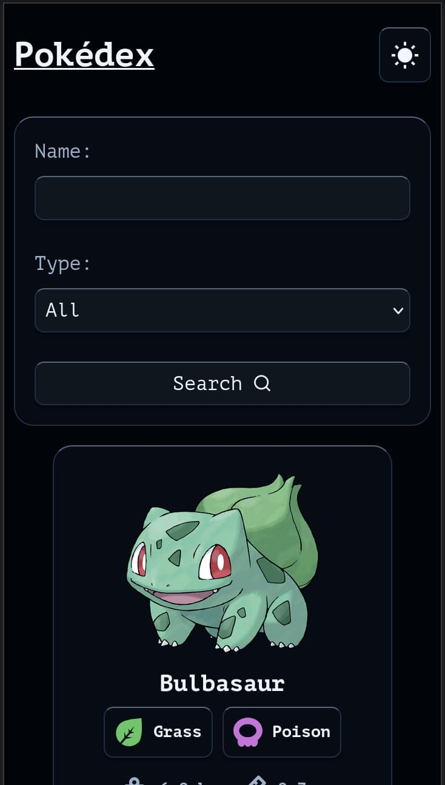

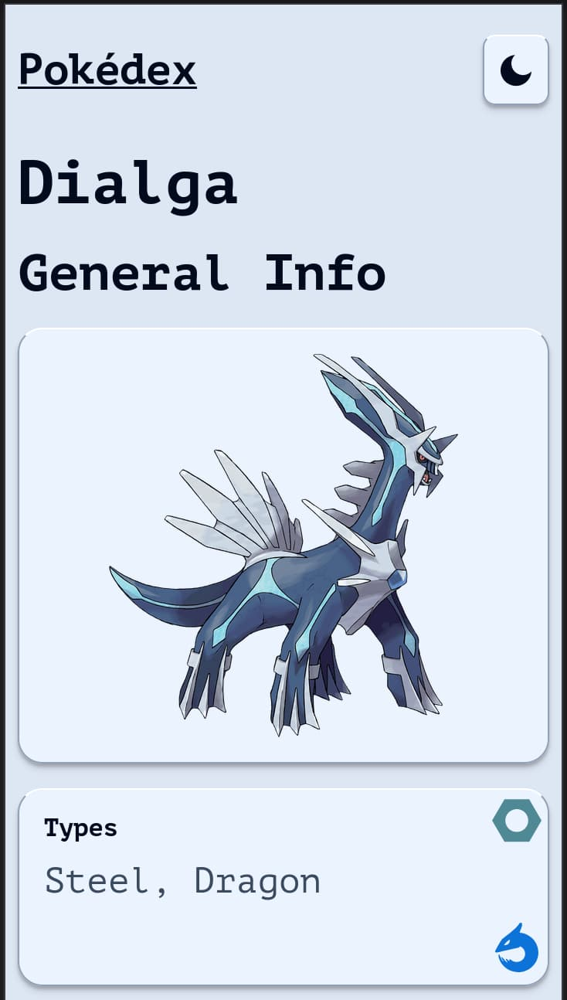
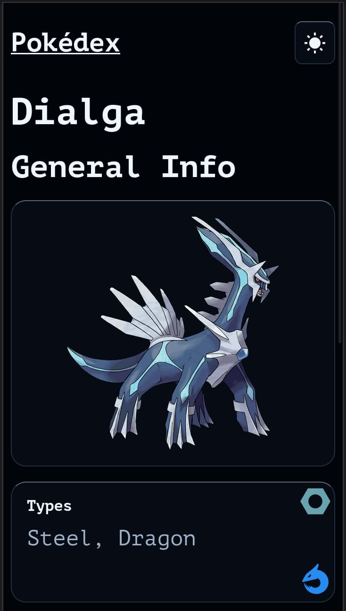

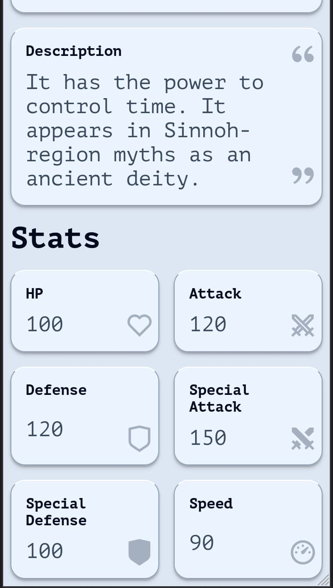
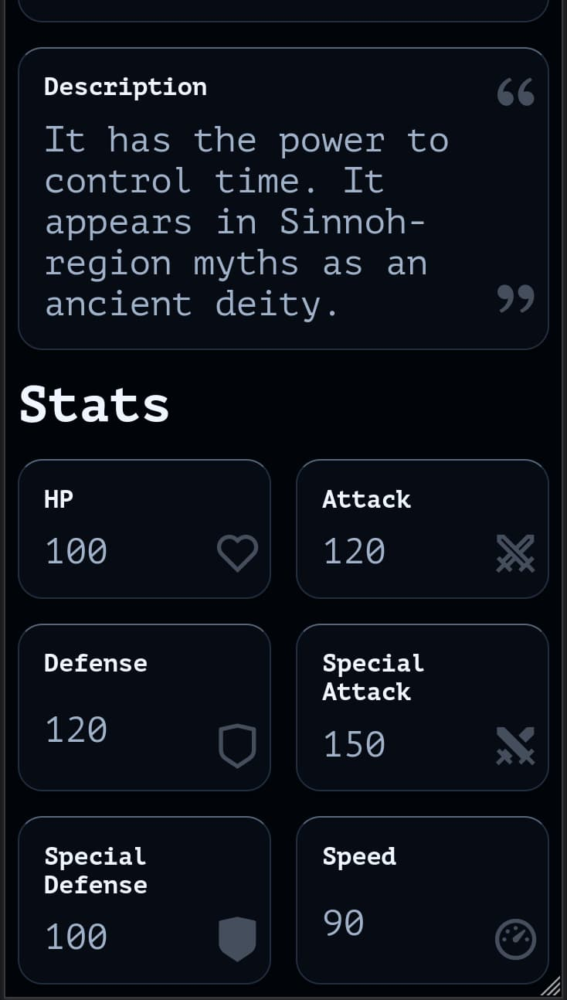

## Resources:

- [UI colors](https://www.iamsajid.com/)
- [Pokemon images](https://github.com/HybridShivam/Pokemon)
- [Pokemon type svg icons](https://github.com/duiker101/pokemon-type-svg-icons)
- [Pokemon JSON data](https://github.com/Purukitto/pokemon-data.json)
